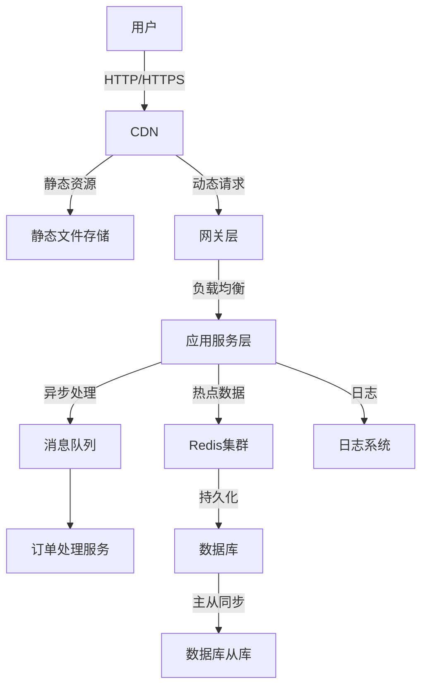

## 1. 什么是秒杀场景？

秒杀是指在特定时间内，用户通过线上平台以极低的价格抢购限量商品或服务的活动。秒杀场景具有以下特点：

- **高并发**：短时间内大量用户同时访问系统，请求量激增。
- **瞬时流量**：流量在秒杀开始时达到峰值，随后迅速下降。
- **库存有限**：商品数量少，需快速判断库存并锁定。
- **低延迟要求**：用户期望快速响应，任何延迟可能导致用户流失。
- **公平性**：确保每个用户有公平的抢购机会，防止恶意刷单或作弊。

常见的秒杀场景包括电商平台的“双 11”促销、节假日特价机票抢购、演唱会门票秒杀等。

<!--summary-->

## 2. 秒杀场景的技术挑战

秒杀系统的设计需要解决以下核心问题：

1. **高并发处理**：如何应对短时间内千万级别的请求？
2. **库存超卖**：如何确保库存不被超卖或超扣？
3. **系统稳定性**：如何防止系统因流量过载而崩溃？
4. **用户体验**：如何保证响应速度快、操作流畅？
5. **防刷与公平性**：如何防止恶意用户或机器人抢占资源？

---

## 3. 秒杀系统架构设计

以下是一个典型的秒杀系统架构设计，分为前端、网关层、业务逻辑层、缓存层和数据库层。

### 3.1 总体架构图



**说明**：

- **CDN**：分发静态资源（如 JS、CSS、图片），降低服务器压力。
- **网关层**：负责流量控制、限流、防刷、身份验证等。
- **应用服务层**：处理核心业务逻辑，如库存校验、订单生成。
- **Redis 集群**：缓存热点数据，减少数据库压力。
- **消息队列**：异步处理订单，解耦系统。
- **数据库**：持久化订单和库存数据，使用主从架构提高读写性能。

---

### 3.2 前端优化

前端在秒杀场景中起到重要作用，主要优化点包括：

1. **静态化**：将秒杀页面静态化，存储在 CDN，减少后端动态渲染压力。
2. **倒计时同步**：通过服务器时间同步，确保秒杀开始时间一致。
3. **请求合并**：对频繁的轮询请求进行合并，减少后端压力。
4. **防重复提交**：前端限制用户重复点击，降低无效请求。
5. **懒加载**：延迟加载非关键资源，提升页面加载速度。

**示例代码（前端倒计时）**:

```javascript
function startCountdown(endTime) {
  const timer = setInterval(() => {
    const now = new Date().getTime();
    const distance = endTime - now;
    if (distance <= 0) {
      clearInterval(timer);
      document.getElementById("countdown").innerText = "秒杀开始！";
      return;
    }
    const seconds = Math.floor((distance % (1000 * 60)) / 1000);
    document.getElementById("countdown").innerText = `剩余时间: ${seconds}秒`;
  }, 1000);
}
```

---

### 3.3 网关层设计

网关层负责流量入口的管理，核心功能包括：

1. **限流**：使用令牌桶或漏桶算法（如 Nginx 的 limit_req 模块）限制请求频率。
2. **防刷**：通过 IP、用户 ID、设备指纹等识别恶意请求，结合验证码机制。
3. **负载均衡**：将请求分发到后端多个服务节点（如 Nginx、LVS）。
4. **黑白名单**：屏蔽恶意 IP，优先处理高优先级用户。

**示例配置（Nginx 限流）**:

```nginx
http {
    limit_req_zone $binary_remote_addr zone=seckill:10m rate=10r/s;
    server {
        location /seckill {
            limit_req zone=seckill burst=20 nodelay;
            proxy_pass http://backend;
        }
    }
}
```

---

### 3.4 应用服务层

应用服务层处理核心业务逻辑，优化点包括：

1. **库存校验**：通过 Redis 的原子操作（如 decr）实现库存扣减，防止超卖。
2. **异步下单**：将订单生成推送到消息队列（如 Kafka、RabbitMQ），异步处理。
3. **热点隔离**：将秒杀商品的接口与普通接口隔离，避免影响其他业务。
4. **熔断降级**：当系统负载过高时，降级为静态页面或拒绝部分请求。

**示例代码（库存扣减）**:

```java
public boolean deductStock(String productId) {
    String key = "seckill:stock:" + productId;
    Long stock = redisTemplate.opsForValue().decrement(key);
    if (stock == null || stock < 0) {
        redisTemplate.opsForValue().increment(key); // 回滚库存
        return false;
    }
    return true;
}
```

---

### 3.5 缓存层

Redis 是秒杀场景中常用的缓存技术，核心用途：

1. **热点数据缓存**：将秒杀商品信息、库存等存储在 Redis 中。
2. **分布式锁**：使用 Redis 的 SETNX 实现分布式锁，保证库存扣减的线程安全。
3. **预减库存**：在 Redis 中预减库存，减少数据库压力。

**示例代码（分布式锁）**:

```java
public boolean acquireLock(String lockKey, String requestId, int expireTime) {
    String result = redisTemplate.execute((RedisCallback<String>) connection ->
        connection.setNX(lockKey.getBytes(), requestId.getBytes()));
    if ("OK".equals(result)) {
        redisTemplate.expire(lockKey, expireTime, TimeUnit.SECONDS);
        return true;
    }
    return false;
}
```

---

### 3.6 消息队列

消息队列用于异步处理订单，缓解数据库压力。常用技术包括 Kafka、RabbitMQ 等。主要步骤：

1. 用户抢购成功后，将订单信息推送到消息队列。
2. 消费者服务异步处理订单，写入数据库。
3. 提供订单状态查询接口，供用户查看结果。

**示例代码（Kafka 生产者）**:

```java
public void sendOrderMessage(String orderInfo) {
    kafkaTemplate.send("seckill_order_topic", orderInfo);
}
```

---

### 3.7 数据库设计

数据库主要负责数据持久化，优化点包括：

1. **读写分离**：主库处理写操作，从库处理读操作。
2. **分库分表**：根据商品 ID 或用户 ID 分片，降低单表压力。
3. **索引优化**：为秒杀相关的表（如订单表、库存表）添加索引。
4. **事务精简**：尽量减少事务范围，避免锁冲突。

**示例 SQL（库存表结构）**:

```sql
CREATE TABLE seckill_product (
    id BIGINT AUTO_INCREMENT PRIMARY KEY,
    product_id VARCHAR(50) NOT NULL,
    stock INT NOT NULL DEFAULT 0,
    start_time DATETIME NOT NULL,
    end_time DATETIME NOT NULL,
    UNIQUE KEY uk_product_id (product_id)
);
```

---

## 4. 防刷与公平性

为保证秒杀的公平性，需采取以下措施：

1. **验证码**：在秒杀前要求用户输入验证码，防止机器人。
2. **用户限制**：限制同一用户只能抢购一次（如通过用户 ID 校验）。
3. **随机延迟**：在前端添加随机延迟，防止脚本抢占。
4. **行为分析**：通过大数据分析用户行为，识别异常请求。

---

## 5. 系统监控与容错

1. **监控**：使用 Prometheus+Grafana 监控系统性能（如 QPS、延迟、错误率）。
2. **日志**：通过 ELK 收集日志，快速定位问题。
3. **容错**：通过 Hystrix 或 Sentinel 实现熔断，防止级联失败。
4. **压测**：使用 JMeter 或 Locust 模拟高并发，验证系统容量。

---

## 6. 总结

秒杀系统是一个典型的高并发场景，涉及前端优化、网关限流、应用服务逻辑、缓存、消息队列和数据库等多个层面。通过合理的架构设计和优化，可以有效应对高并发流量，保证系统稳定性和用户体验。关键点在于：

- **流量削峰**：通过 CDN、限流、异步处理分散流量。
- **库存控制**：使用 Redis 原子操作防止超卖。
- **公平性**：通过验证码、防刷机制保障公平。
- **监控与容错**：实时监控系统状态，快速响应异常。

希望这篇文章对设计秒杀系统有所帮助！
