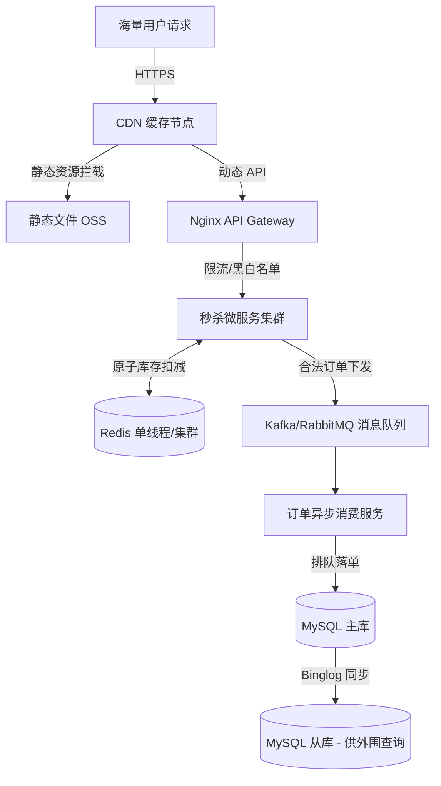

## 1. 什么是秒杀场景？

秒杀是指在特定时间内，用户通过线上平台以极低的价格抢购限量商品或服务的活动。秒杀场景在技术上是一个极致的试金石，具备以下极端特征：

- **瞬时极高并发**：平时系统 QPS 只有几百，而在秒杀开始的 1 秒内，瞬间飙升到几万甚至几十万。
- **读多写少**：几万人同时疯狂刷新页面查看库存（读请求），但真正能抢到商品（写请求）的只有一百人。
- **绝不能超卖**：库存只有 100 件，如果在并发下卖出了 101 件，平台就要自己倒贴赔钱，这是秒杀系统的底线。
- **黄牛与防刷**：羊毛党和黑产会使用自动化脚本进行机器抢购，严重破坏活动公平性。

日常常见的场景包括：“双 11”整点促销、12306 春运抢票、演唱会门票发售等。

<!--summary-->

---

## 2. 核心挑战与应对策略：漏斗模型

面对瞬时百万流量，我们如果让所有请求都打到最终的数据库上，数据库会瞬间发生连接池耗尽、死锁甚至宕机。因此，秒杀系统设计的黄金法则是：**漏斗限流架构（Layered Funnel）**。

其核心思想是：**在请求到达最终数据库之前，一层一层地拦截请求，将流量像漏斗一样逐层递减。**

1. **客户端层**：拦截 50% 无效的重复点击。
2. **CDN & 接入网关层**：通过缓存静态资源、IP 频控等拦截 30% 流量。
3. **应用服务层**：通过 Redis 内存缓存、业务规则校验过滤掉 19% 的流量。
4. **数据库层**：最终只有极少部分（约 1%）有效真实订单会异步落库。

---

## 3. 总体架构演进设计

这里是一个典型的互联网电商秒杀架构设计图：


```mermaid
graph TD
    A[海量用户请求] -->|HTTPS| B[CDN 缓存节点]
    B -->|静态资源拦截| C[静态文件 OSS]
    B -->|动态 API| D[Nginx API Gateway]
    D -->|限流/黑白名单| E[秒杀微服务集群]
    E <-->|原子库存扣减| F[(Redis 单线程/集群)]
    E -->|合法订单下发| G[Kafka/RabbitMQ 消息队列]
    G --> H[订单异步消费服务]
    H -->|排队落单| I[(MySQL 主库)]
    I -->|Binglog 同步| J[(MySQL 从库 - 供外围查询)]
```

---

## 4. 层层击破：核心模块代码与实战

### 4.1 前端优化的极致：防抖与动态URL

除了将页面的图片、CSS、JS 甚至动态的库存数提前静态化推送到 CDN，我们还要防止用户无脑疯狂点击。

**防重复点击（按钮置灰）**：点击一次后，强行将按钮置灰 3 秒，防止 `while(true)` 般的疯狂发送。
**动态秒杀 URL**：秒杀的接口不能提前暴露，否则黄牛写个脚本在秒杀前 1ms 开始发包。必须在秒杀开始的瞬间，从服务端请求一段动态的 MD5 盐值，通过这个动态 URL 才能发起真实的扣减。

### 4.2 网关层限流（Nginx Limit）

网关负责拦截大部分不正常的请求，例如单 IP 一秒内发起了 100 次请求，直接返回 `503 Service Unavailable`。

基于 Nginx 漏桶算法的精简配置：

```nginx
http {
    # 按照客户端 IP 进行限流，空间为 10M，速率限制为每秒 10 个请求
    limit_req_zone $binary_remote_addr zone=seckill_limit:10m rate=10r/s;

    server {
        location /api/seckill {
            # 瞬间并发最大容忍 20 个请求排队，超过则直接拒绝（nodelay）
            limit_req zone=seckill_limit burst=20 nodelay;
            proxy_pass http://backend_seckill_cluster;
        }
    }
}
```

### 4.3 Redis 原子扣减库存：Lua 脚本的核心应用

应用层绝不能通过 MySQL 的 `UPDATE stock = stock - 1 WHERE id = 1` 来扣减库存，因为这会引发严重的行锁争用。
即使是用 Redis，如果是先查（get）后扣（decr），在并发下也会导致超卖。

**最佳实践：利用 Redis 单线程执行 Lua 脚本的原子性，将查与扣合二为一。**

```java
@Service
public class SeckillService {

    @Autowired
    private StringRedisTemplate redisTemplate;

    @Autowired
    private KafkaTemplate<String, String> kafkaTemplate;

    // Lua 脚本：原子化判断库存并扣减
    private static final String SCRIPT =
        "if (redis.call('exists', KEYS[1]) == 1) then" +
        "    local stock = tonumber(redis.call('get', KEYS[1]));" +
        "    if (stock > 0) then" +
        "        redis.call('decr', KEYS[1]);" +
        "        return 1;" + // 抢购成功
        "    end;" +
        "end;" +
        "return 0;"; // 抢购失败

    public boolean doSeckill(Long userId, Long productId) {
        String key = "seckill:stock:" + productId;

        // 1. 利用 Redis 执行 Lua 脚本，保证原子操作绝对不超卖
        DefaultRedisScript<Long> redisScript = new DefaultRedisScript<>(SCRIPT, Long.class);
        Long result = redisTemplate.execute(redisScript, Collections.singletonList(key));

        if (result != null && result == 1L) {
            // 2. 扣减成功！将订单信息发送到消息队列，实现异步落库解耦
            String orderMsg = String.format("{\"userId\":%d, \"productId\":%d}", userId, productId);
            kafkaTemplate.send("seckill_order_topic", orderMsg);
            return true;
        }

        return false; // 库存不足，直接丢弃请求
    }
}
```

### 4.4 消息队列与彻底解耦 (Kafka)

利用 Kafka 等 MQ 可以完美解决 MySQL 写瓶颈。我们将秒杀成功这件“喜讯”发送给 Kafka，前台直接告诉用户：“抢购成功，正在排队生成订单...”。
后台真正的订单服务（Order Service）根据自己的 MySQL 承载能力，以恒定的速率慢条斯理地消费 Kafka 中的消息进行落表。

```java
@Component
public class OrderConsumer {

    @Autowired
    private OrderRepository orderRepository;

    @KafkaListener(topics = "seckill_order_topic", groupId = "seckill-group")
    public void consume(String message) {
        // 将 JSON 反序列化为对象（伪代码）
        OrderRequest req = JSON.parseObject(message, OrderRequest.class);

        // 慢条斯理地进行数据库主键生成与落盘
        Order order = new Order();
        order.setUserId(req.getUserId());
        order.setProductId(req.getProductId());
        order.setStatus("CREATED");
        order.setCreateTime(new Date());

        // 最终抗下了高并发，安全写入 MySQL
        orderRepository.save(order);
    }
}
```

---

## 5. 总结：系统设计的哲学

秒杀系统的设计，其实是一场防御战。我们通过前置的防刷校验、CDN 分流、网关限流，保护了核心的应用层；接着通过 Redis 单线程天生的特性避免了复杂的并发锁控制；最后用消息队列的异步机制保护了脆弱的关系型数据库。

**核心箴言**：

- **静态请求提前拦，动态请求散列分。**
- **少读多写用缓存，异步处理用队列。**
- **不要把压力留给最脆弱的组件。**
